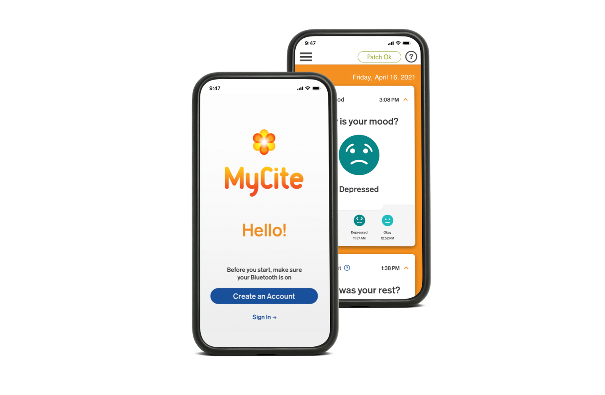
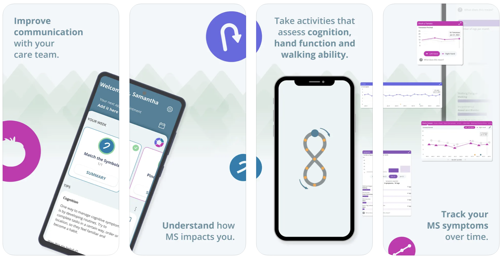
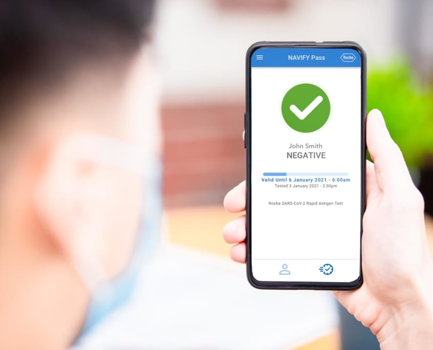
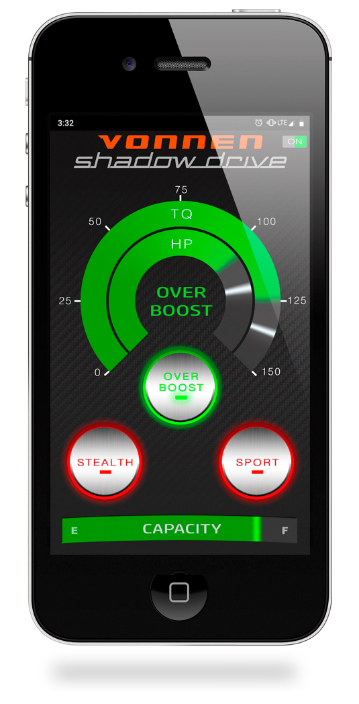
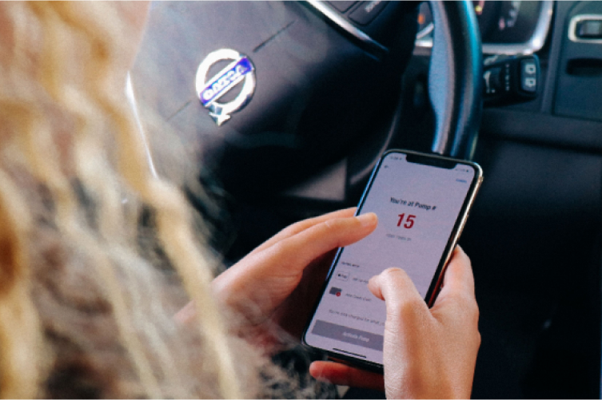
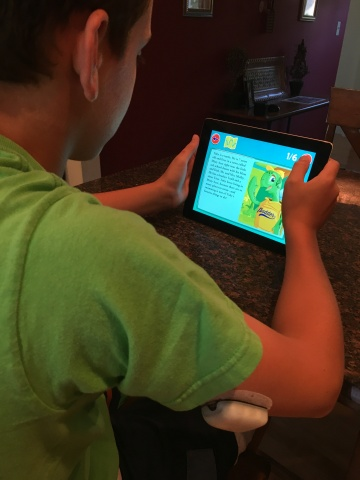
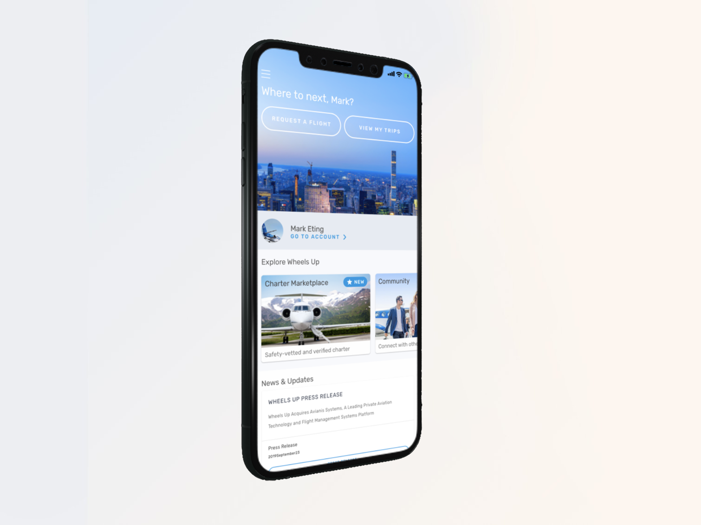
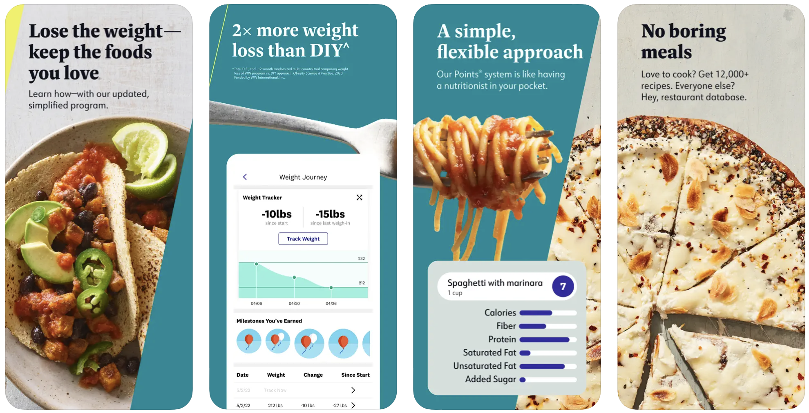
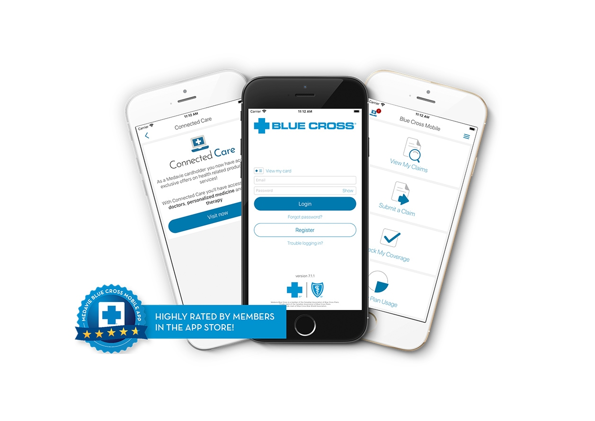
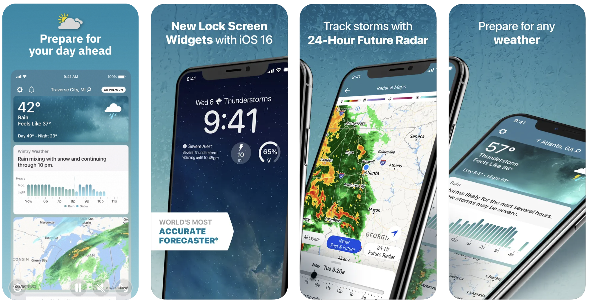

# iOS Developer-Portfolio - William Wallace

## MyCite - Otsuka
The [MYCITE® App](https://www.abilifymycite.com) is part of a digital medicine system that helps you and your healthcare team stay on top of how your treatment is going.
The 3 components — a smart pill with sensor, a non-medicated MYCITE® Patch, and the app—receive and display your daily health data. Data displayed on the app include when you take your pill, your activity level, and time spent resting. It also allows you to select your mood, how well you rested, and the reason, if you didn’t take your pill.

##### 🔨Technologies: Swift, Unit Tests, CI, BLE, Push Notifications, REST API.
##### 🚀Platform: 📱iOS, iPhone.

## Floodlight MS - Roche
The [Floodlight MS](https://floodlightms-us.com/) app A smartphone app backed by science and created for people living with MS

##### 🔨Technologies: Swift, UIKit, SwiftUI, Unit and UI Test, Push Notifications, REST API
##### 🚀Platform: 📱iOS, iPhone

## Navify Pass - Roche
The [Navify Pass](https://navify.roche.com/products/navify-pass/) app is a simple, convenient way to manage health credentials. Navify Pass offers individuals and providers a seamless and secure way to track, manage and share health credentials.

##### 🔨Technologies: Swift, UIKit, SwiftUI, Unit and UI Test, Push Notifications, REST API
##### 🚀Platform: 📱iOS, iPhone

## Navify Pass Professional - Roche
The [Navify Pass Professional](https://navify.roche.com/products/navify-pass/) enables qualified individuals to enter test results into the NAVIFY Pass system.

##### 🔨Technologies: Swift, UIKit, SwiftUI, Unit and UI Test, Push Notifications, REST API
##### 🚀Platform: 📱iOS, iPhone

## Shadow Drive Connect - Vonnen
[Shadow Drive](https://www.vonnen.com/technology)'s app allows you to select various drive modes through your smartphone or to disable it entirely. Companion app for Porsche 911 EV conversion kit. I was the sole mobile developer of the app.

##### 🔨Technologies: Swift, MVC, Unit Tests, BLE 
##### 🚀Platform: 📱iOS, iPhone.

## Kum & Go
The [Kum & Go](https://www.kumandgo.com/rewards) app is your one-stop-shop for touch-less fueling, fresh food, rewards, and exclusive offers.

##### 🔨Technologies: Swift, MVC
##### 🚀Platform: 📱iOS, iPhone

## Toby's T1D Tale - Insulet
Insulet's [Toby's T1D Tale](https://investors.insulet.com/news/news-details/2016/Insulet-Launches-New-Educational-iPad-App-Tobys-T1D-Tale/default.aspx) mobile app is an educational resource geared towards kids with and without type 1 diabetes to help them learn more about diabetes.

##### 🔨Technologies: Swift, MVC, Unit Tests
##### 🚀Platform: 📱iOS, iPad.

## Wheels Up
The [Wheels Up](https://apps.apple.com/us/app/wheels-up/id956615077) The trusted private aviation solution for individuals, families and businesses.
Whether you're booking your own flight or looking to share with other members, the Wheels Up App makes it easy to search and book for the aircraft option that meets your financial and travel needs

##### 🔨Technologies: Swift, MVC
##### 🚀Platform: 📱iOS, iPhone

 
## WeightWatchers
The [WeightWatchers®](https://apps.apple.com/us/app/ww-weightwatchers/id331308914) app is for people who want more from weight loss.

##### 🔨Technologies: Objective-C, MVC
##### 🚀Platform: 📱iOS, iPhone

## Blue Cross Mobile - Medavie
The [Blue Cross Mobile](https://www.medaviebc.ca/en/members/medavie-blue-cross-mobile-app) app provides fast, reliable, and easy access for Medavie Blue Cross, Ontario Blue Cross and Quebec Blue Cross members to manage their benefits – anytime, anywhere.

##### 🔨Technologies: Objective-C, MVC
##### 🚀Platform: 📱iOS, iPhone

## Weather - The Weather Channel
The [Weather](https://weather.com/news/news/2018-08-25-the-weather-channel-app-update) app is one of the most popular weather apps available. Track daily forecasts and receive live radar updates, storm alerts, & local precipitation updates.

##### 🔨Technologies: Objective-C, MVC
##### 🚀Platform: 📱iOS, iPhone

## Boston Globe
The [Boston Globe](https://pages.bostonglobe.com/mobileapps/the-boston-globe-app/) app is the best way to experience our journalism on your mobile device.

##### 🔨Technologies: Objective-C, MVC
##### 🚀Platform: 📱iOS, iPhone

