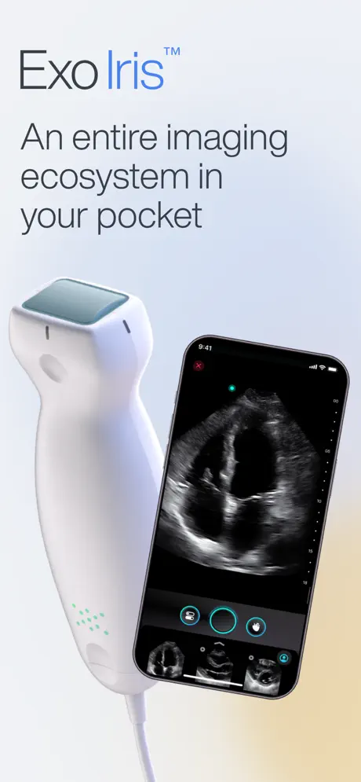
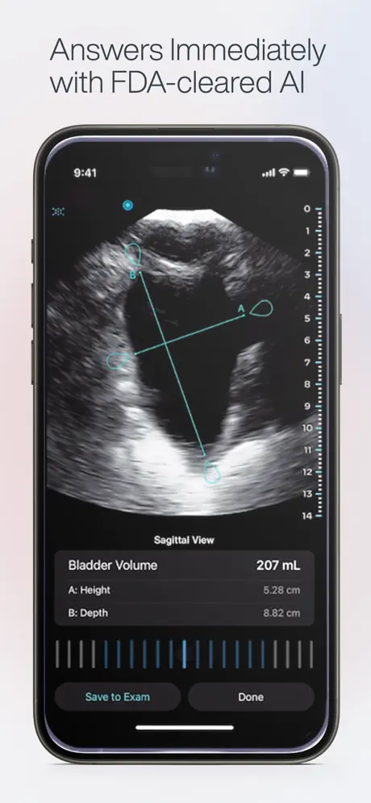
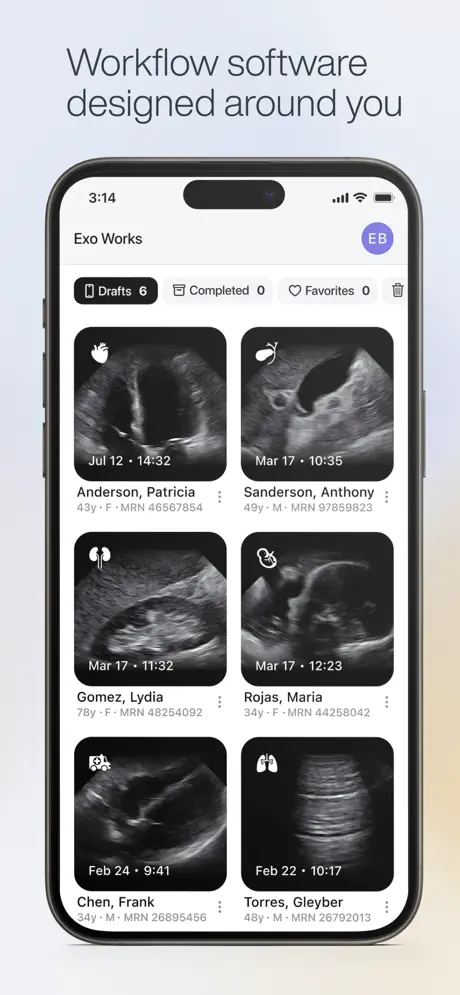
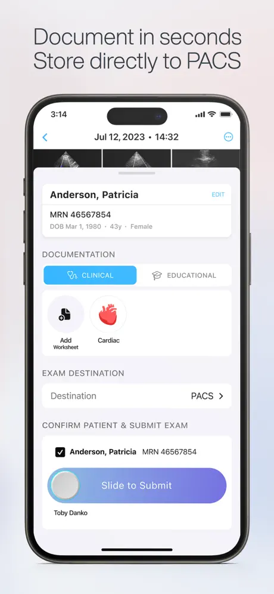

# Exo Iris — Exo Imaging

[← Back to portfolio](../README.md)

**Focus:** Handheld ultrasound imaging over MFi USB, with real-time AI at the point of care

The [Exo Iris™](https://apps.apple.com/us/app/exo-iris/id6459233536) app pairs with a 3-in-1 handheld ultrasound device that Exo Imaging describes as category-redefining: a complete medical imaging ecosystem in your pocket. Proprietary silicon technology combines advanced imaging, workflow software and real-time AI to put point-of-care answers in the hands of clinicians, with images displayed right on a smartphone.

Built-in AI indicators help clinicians at the bedside, from lung findings such as pleural effusion and consolidation/atelectasis, to cardiac ejection fraction, to bladder volume. Exo reports 14 FDA-cleared AI indicators on Iris as of mid-2025.

Intended for use by trained medical professionals only. Findings should be reviewed with a clinician before acting on them.

## Regulatory Status
The Exo Iris handheld ultrasound system is FDA 510(k)-cleared (original clearance 2021, expanded 2022). Its AI indicators are cleared separately, including bladder volume, cardiac ejection fraction and lung findings.

## My Role
Integrated the ultrasound device with the iOS app over MFi USB.

## Details
* **Technologies:** MFi (Made for iPhone) USB accessory integration
* **Platform:** iOS, iPhone
* **Domain:** Healthcare, medical imaging
* **App Store:** [Exo Iris](https://apps.apple.com/us/app/exo-iris/id6459233536)

