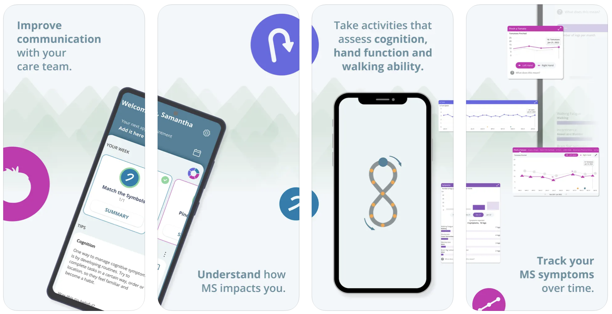

# Floodlight MS — Roche

[← Back to portfolio](../README.md)

**What it is:** Clinically validated digital health app capturing sensorimotor data for multiple sclerosis research.

The [Floodlight MS](https://floodlightms-us.com/) app is a smartphone app backed by science and created for people living with MS. It is a clinically validated digital health app capturing sensorimotor data for multiple sclerosis research.

## My Role
Built sensor-based active test interfaces and patient flows with comprehensive unit/UI test coverage.

## Details
* **Technologies:** Swift, UIKit, SwiftUI, Sensor Data, Unit and UI Tests, Push Notifications, REST API
* **Platform:** iOS, iPhone
* **App Store:** [Floodlight MS](https://apps.apple.com/au/app/floodlight-ms/id1528260411)

