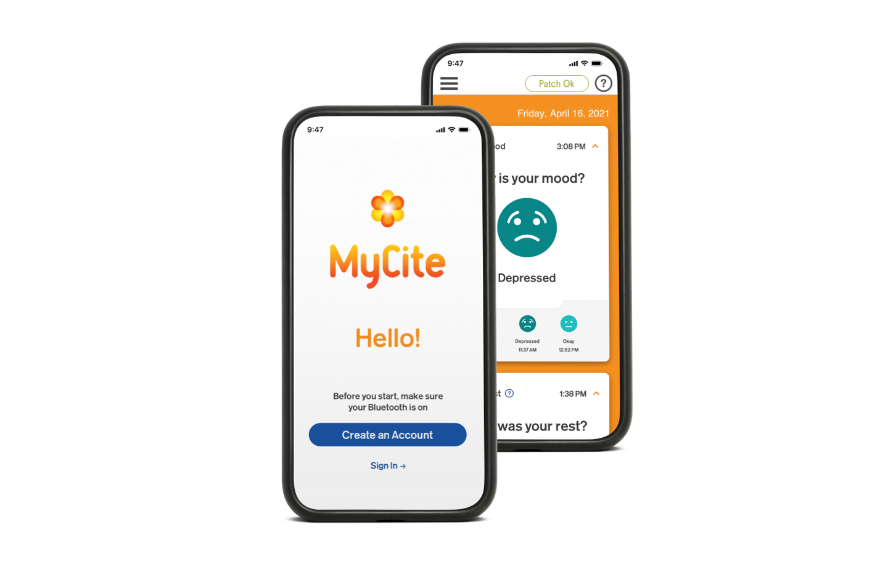

# MyCite — Otsuka Pharmaceutical

[← Back to portfolio](../README.md)

**What it is:** Digital medicine system pairing an ingestible pill sensor and wearable patch to track adherence.

The [MYCITE® App](https://www.abilifymycite.com) is part of a digital medicine system that helps you and your healthcare team stay on top of how your treatment is going.

The three components — a smart pill with sensor, a non-medicated MYCITE® Patch, and the app — receive and display your daily health data. Data displayed in the app includes when you take your pill, your activity level, and time spent resting. It also lets you record your mood, how well you rested, and the reason if you didn't take your pill.

## My Role
Built the BLE communication layer interfacing with the wearable sensor patch; implemented local data ingestion and session adherence pipelines.

## Details
* **Technologies:** Swift, CoreBluetooth (BLE), Unit Tests, CI/CD, Push Notifications, REST API
* **Platform:** iOS, iPhone
* **App Store:** [MyCite](https://apps.apple.com/us/app/mycite/id1539735389)

