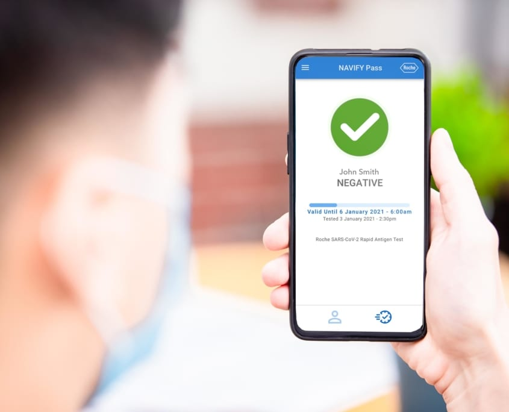

# Navify Pass & Navify Pass Professional — Roche

[← Back to portfolio](../README.md)

**Focus:** Health credential management & clinical provider entry

## Navify Pass
The [Navify Pass](https://navify.roche.com/products/navify-pass/) app is a simple, convenient way to manage health credentials. It offers individuals and providers a seamless and secure way to track, manage and share health credentials.

* **Technologies:** Swift, UIKit, SwiftUI, Unit and UI Tests, Push Notifications, REST API
* **Platform:** iOS, iPhone
* **App Store:** [Navify Pass](https://apps.apple.com/au/app/navify-pass/id1543101701)

## Navify Pass Professional
[Navify Pass Professional](https://navify.roche.com/products/navify-pass/) enables qualified individuals to enter test results into the NAVIFY Pass system.

* **Technologies:** Swift, UIKit, SwiftUI, Unit and UI Tests, Push Notifications, REST API
* **Platform:** iOS, iPhone
* **App Store:** [Navify Pass Professional](https://apps.apple.com/au/app/navify-pass-professional/id1543101823)

