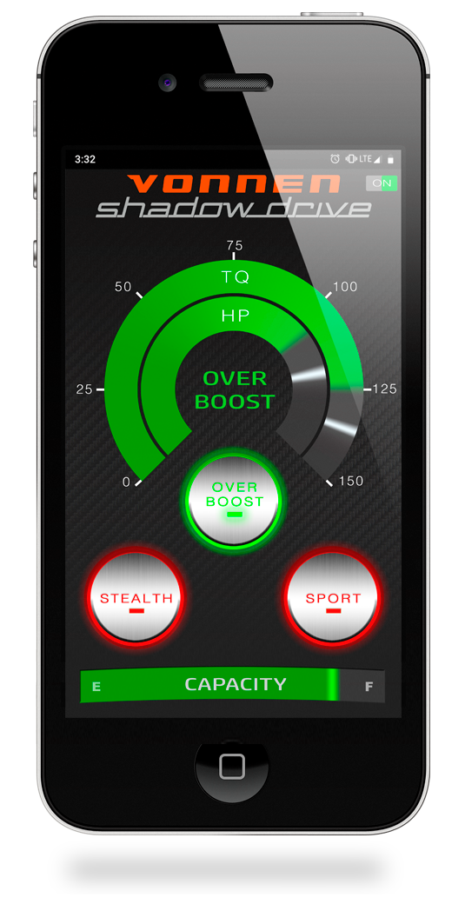

# Shadow Drive Connect — Vonnen

[← Back to portfolio](../README.md)

**What it is:** Companion app for an aftermarket hybrid powertrain upgrade (150 hp electric motor) on Porsche 911s.

[Shadow Drive](https://www.vonnen.com/technology)'s app lets you select various drive modes through your smartphone or disable the system entirely. It is the companion app for Vonnen's aftermarket hybrid powertrain upgrade (150 hp electric motor) for the Porsche 911.

## My Role
Sole mobile engineer. Integrated the Bluetooth interface communicating with the vehicle's Engine Management Unit (EMU) for real-time telemetry, mode switching, and diagnostics.

## Details
* **Technologies:** Swift, CoreBluetooth (BLE), Embedded C, Real-Time Telemetry, MVC, Unit Tests
* **Platform:** iOS, iPhone
* **App Store:** [Shadow Drive Connect](https://apps.apple.com/us/app/shadow-drive-connect/id1508458541)

