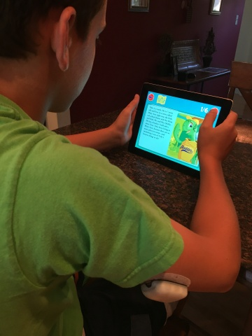

# Toby's T1D Tale — Insulet

[← Back to portfolio](../README.md)

Insulet's [Toby's T1D Tale](https://investors.insulet.com/news/news-details/2016/Insulet-Launches-New-Educational-iPad-App-Tobys-T1D-Tale/default.aspx) mobile app is an educational resource geared towards kids with and without type 1 diabetes to help them learn more about diabetes.

**Focus:** Pediatric diabetes education & insulin therapy UX

## Details
* **Technologies:** Swift, MVC, Unit Tests
* **Platform:** iOS, iPad
* **App Store:** [Toby's T1D Tale](https://apps.apple.com/us/app/tobys-t1d-tale/id1124456707)

