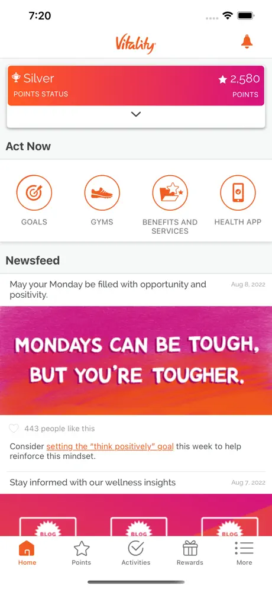
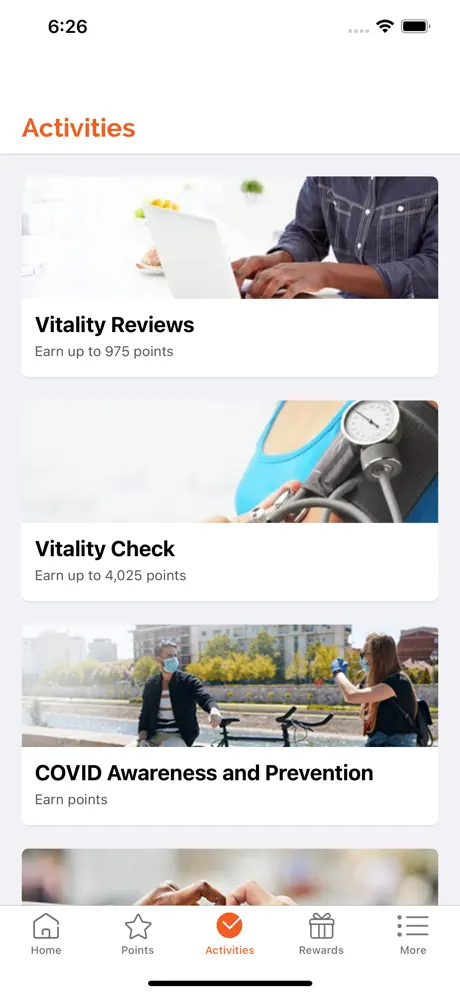
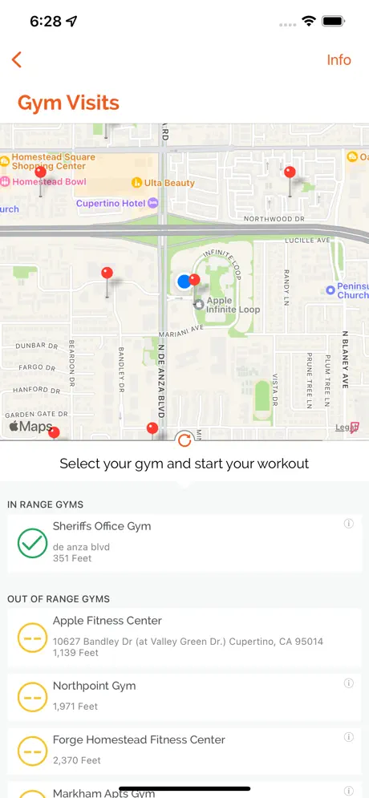

# Vitality Today

[← Back to portfolio](../README.md)

**Focus:** Wellness rewards & HealthKit activity sync

Vitality Today is with you every step of your wellness journey. Vitality members can track their progress from their phone: check Vitality Points, log GPS-tracked workouts, submit proof of completed activities, sync with Apple Health, read a daily newsfeed and check in on their goals.

Available to Vitality members, who sign in with their Power of Vitality credentials.

## My Role
Implemented the app's HealthKit integration.

## Details
* **Technologies:** HealthKit
* **Platform:** iOS, iPhone
* **App Store:** [Vitality Today](https://apps.apple.com/us/app/vitality-today/id491012082)

