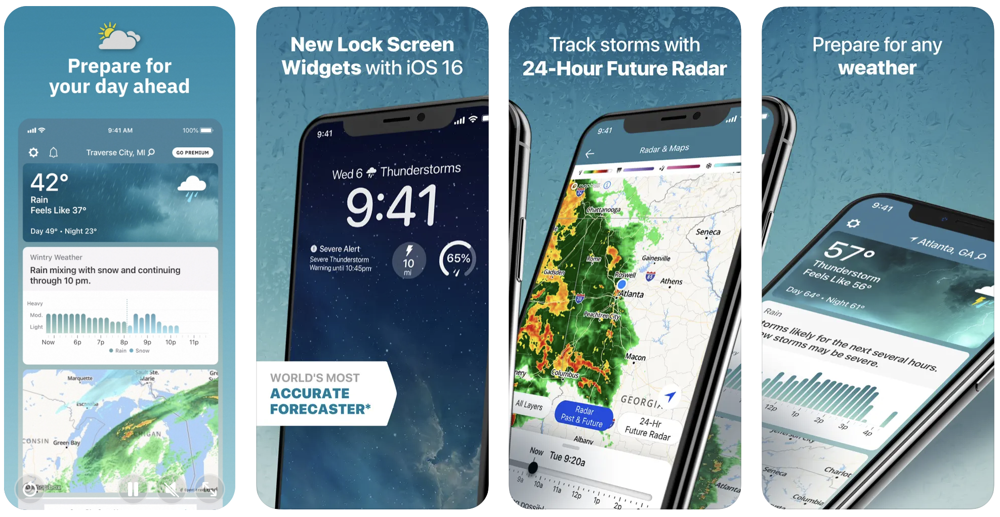

# Weather — The Weather Channel

[← Back to portfolio](../README.md)

The [Weather](https://weather.com/news/news/2018-08-25-the-weather-channel-app-update) app is one of the most popular weather apps available. Track daily forecasts and receive live radar updates, storm alerts, and local precipitation updates.

**Focus:** Real-time radar mapping & location alert triggers

## Details
* **Technologies:** Objective-C, MVC
* **Platform:** iOS, iPhone
* **App Store:** [Weather - The Weather Channel](https://apps.apple.com/us/app/weather-the-weather-channel/id295646461)

